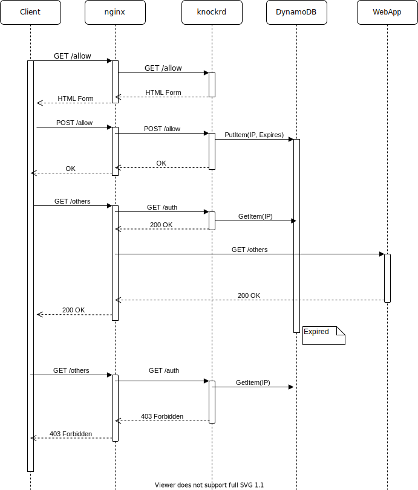
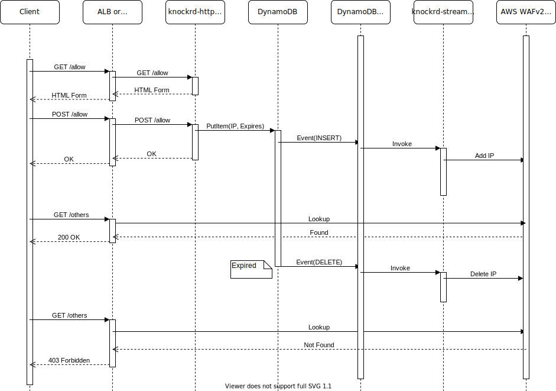
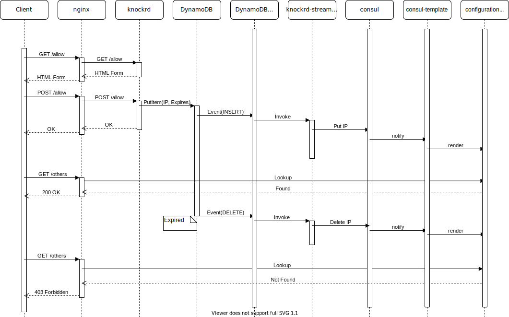

# knockrd

HTTP knocker daemon.

## Usage

```console
Usage of knockrd:
  -config string
    	config file name
  -debug
    	enable debug log
```

```yaml
port: 9876
table_name: knockrd  # DynamoDB table name
ttl: 300             # Expiration(sec) for allowed access
real_ip_from:
  - 10.0.0.0/8
```

## Usage with Nginx auth_request directive

knockrd works with nginx auth_request directive and Amazon DynamoDB.

Nginx example configuration.

```
http {
    server {
       listen 80;
       location = /allow {
           proxy_set_header X-Forwarded-For $proxy_add_x_forwarded_for;
           proxy_pass http://127.0.0.1:9876;
       }
       location = /auth {
           internal;
           proxy_set_header X-Forwarded-For $proxy_add_x_forwarded_for;
           proxy_pass http://127.0.0.1:9876;
       }
       location / {
           auth_request /auth;
           root /var/www/htdocs;
       }
    }
}
```

knockrd process must have IAM policies which allows actions as below.

- dynamodb:DeleteItem
- dynamodb:GetItem
- dynamodb:PutItem
- dynamodb:UpdateItem
- dynamodb:DiscribeTable
- dynamodb:DiscribeTimeToLive
- dynamodb:CreateTable (* if a table in config is not exist)
- dynamodb:UpdateTimeToLive (*)

### Authorization Flow

1. A user accesses to `/allow`.
   - This location must be protected by other methods like OAuth or etc.
1. knockrd shows HTML form to allow access from the user's IP address.
1. The user pushes the "Allow" button.
1. knockrd store the IP address to the backend(DynamoDB) with TTL.
1. The user accesses to other locations.
1. Nginx auth_request directive requests to knockrd `/auth`.
1. knockrd compares the IP address with the backend and returns 200 OK or 403 Forbidden.
1. Nginx allows or denies the user's request based on the knockrd response.
1. DynamoDB expires the item after TTL.



## Usage with AWS WAF v2 IP Set (serverless)

knockrd works with AWS WAF v2, AWS Lambda and Amazon DynamoDB.

Prepare an IAM Role for lambda functions. `arn:aws:iam::{your account ID}:role/knockrd_lambda`
The role must have policies which allows actions as below.

- wafv2:GetIPSet
- wafv2:UpdateIPSet
- dynamodb:DeleteItem
- dynamodb:GetItem
- dynamodb:PutItem
- dynamodb:UpdateItem
- dynamodb:DiscribeTable
- dynamodb:DiscribeTimeToLive
- dynamodb:CreateTable (* if a table in config is not exist)
- dynamodb:UpdateTimeToLive (*)

Prepare IP sets for AWF WAF v2.

Prepare config.yaml for the IP sets.

```yaml
table_name: knockrd  # DynamoDB table name
ttl: 300s
ip-set:
  v4:
    id: ddcdf8ad-251c-4c8f-b12f-05628b87beb6
    name: knockrd
    scope: REGIONAL
```

Deploy two lambda functions, knockrd-http and knockrd-stream in [lambda directory](https://github.com/fujiwara/knockrd/tree/master/lambda) with the IAM role and config.yaml. The example of lambda directory uses [lambroll](https://github.com/fujiwara/lambroll) for deployment.

### Authorization Flow

1. A user accesses to `/allow` provided by knockrd-http.
   - This location must be protected by other methods like OAuth or etc.
1. knockrd-http shows HTML form to allow access from the user's IP address.
1. The user pushes the "Allow" button.
1. knockrd-http store the IP address to the backend(DynamoDB) with TTL.
    - knockrd-stream adds the address to AWS WAF IP Set by events on the dynamodb stream.
1. The user accesses to other locations.
1. AWS WAF allows or denies the user's request based on the ip sets.
1. DynamoDB expires the item after TTL.
    - knockrd-stream deletes from IP set by events on the stream.



## Usage with Consul and consul-template

knockrd works with [Consul](https://www.consul.io/), AWS Lambda and Amazon DynamoDB.

### Authorization Flow

1. A user accesses to `/allow` provided by knockrd.
   - This location must be protected by other methods like OAuth or etc.
1. knockrd shows HTML form to allow access from the user's IP address.
1. The user pushes the "Allow" button.
1. knockrd store the IP address to the backend(DynamoDB) with TTL.
    - knockrd-stream adds the address to Consul KV by events on the dynamodb stream.
1. [consul-template](https://github.com/hashicorp/consul-template) renders a configuration file for nginx with items in Consul KV.
1. The user accesses to other locations.
1. nginx allows or denies the user's request based on the configuration file.
1. DynamoDB expires the item after TTL.
    - knockrd-stream deletes from Consul KV by events on the stream.
1. consul-template] renders a configuration file.



A example of consul-template's template and consul-template command for nginx.

```ctmpl
location / {
  {{ range ls "knockrd/allowed" }}
  allow {{ .Value }};{{ end }}
  deny all;
}
```

```console
# consul-template -template "allowed.ctmpl:/etc/nginx/allowed.conf:service nginx reload"
```

consul-template renders a configuration file by the template when Key-Values are changed on Consul, and then reload nginx.

## LICENSE

MIT License

Copyright (c) 2020 FUJIWARA Shunichiro
